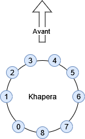
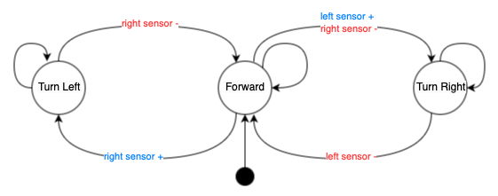

## Code source et vidéos

Le code complet de réponse aux différentes questions ainsi que les vidéos sont disponibles sur notre [Repository GitHub](https://github.com/JeremyGraffan/sia-td4/tree/master).

## Positionnement et nom des capteurs


## Question 2 (Simulateur)

_Reprenez votre TD précédent et implémentez le déplacement de votre robot en ligne droite et son arrêt devant le premier obstacle rencontré._

### Principe de fonctionnement

Pour arrêter le robot devant le premier obstacle rencontré 
nous utilisons les 4 capteurs situés a l'avant du robot. 
Le robot avance en ligne droite avec une vitesse constante. 
Lorsque l'un des capteurs détecte un obstacle 
(valeur supérieur a une limite définie), le robot s'arrête. 
Si l'obstacle disparaît, le robot recommence a avancer en ligne droite.

### Vidéo
[Téléchargement de la vidéo](https://github.com/JeremyGraffan/sia-td4/raw/master/video/q2.mp4)

### Code
```c
static const int front_sensor_indexes[FRONT_SENSOR_COUNT] = { 2, 3, 4, 5 };
static const double speed = 10;

while (wb_robot_step(time_step) != -1) {
  double sensors_value[FRONT_SENSOR_COUNT];
  double current_speed = speed;

  for (int i = 0; i < FRONT_SENSOR_COUNT; i++) {
    sensors_value[i] = wb_distance_sensor_get_value(sensors[front_sensor_indexes[i]]);
    if (sensors_value[i] > 100.0 )
    {
      current_speed = 0;
      break;
    }
  }

  wb_motor_set_velocity(left_motor, current_speed);
  wb_motor_set_velocity(right_motor, current_speed);
}
```
[Code complet](https://github.com/JeremyGraffan/sia-td4/blob/master/code/q2.c)

### Equation
$$
V_r = 
\begin{cases}
    9, & \text{if } \forall{x}\in{X_{front}}, x \leq 100\\
    0,              & \text{otherwise}
\end{cases}
$$
$$
V_l = 
\begin{cases}
    9, & \text{if } \forall{x}\in{X_{front}}, x \leq 100\\
    0,              & \text{otherwise}
\end{cases}
$$

## Question 3 (Simulateur)

_Avec le simulateur Webots, en utilisant le robot khepera III, implémentez cet algorithme en utilisant tous les proximétres du robot. Choisissez les bons poids pour que le robot est un comportement satisfaisant._

### Matrice de poids pour les capteurs 1 à 9
$$
W = 
\begin{pmatrix}
-2.67 & -10.86 & -16.03 & -37.4 & 37.4 & 26.71 & 21.37 & -2.67 & -5.34 \\
-2.67 & 21.37 & 26.71 & 37.4 & -32.06 & -21.37 & -10.86 & -2.67 & -5.34
\end{pmatrix}
$$

### Équation
$$ 
\begin{aligned}
Vr = k * \sum_{x=0}^{8} (W_{ri}.X_i) \\
\end{aligned}
$$

$$ 
\begin{aligned}
Vr = 1 * ( -2.67.X_0 + 21.37.X_1 + 26.71.X_2 \\
    + 37.4.X_3 -32.06.X_4 -21.37.X_5 \\
    -10.86.X_6 -2.67.X_7 -5.34.X_8 )
\end{aligned}
$$

$$ 
\begin{aligned}
Vl = {k * \sum_{x=0}^{8} (W_{li}.X_i)} \\
\end{aligned}
$$

$$ 
\begin{aligned}
Vl = 1 * ( -2.67.X_0 -10.86.X_1 -16.03.X_2 \\
    -37.4.X_3 + 37.4.X_4 + 26.71.X_5 \\
    + 21.37.X_6 -2.67.X_7 -5.34.X_8 ) 
\end{aligned}
$$

### Code

[Code complet](https://github.com/JeremyGraffan/sia-td4/blob/master/code/q3.c)

## Question 4
_Comment implémenteriez-vous un réseau de neurones pour l’évitement d’obstacles selon braintenberg dans le cas de l’alphabot2 ?_

Pour simuler l'AlphaBot dans le cadre du logiciel Webot nous avons réutilisé le Khepera III en conservant uniquement
2 capteurs avant et en binarisant leur valeur (0 ou 1 à partir d'un seuil).
```c
double binarize_sensor_value(double sensor_value) {
  return sensor_value > 40 ? 1 : 0;
}

void process() {
  const double alphabot_matrix[2][2] = {{-9, 9}, {9, -9}};
  const int alphabot_sensor_indexes[ALPHABOT_SENSOR_COUNT] = {2, 5};
  const double base_speed = 10;
  double speed[2] = {0, 0};

  while (wb_robot_step(time_step) != -1) {
    double sensors_value[ALPHABOT_SENSOR_COUNT];

    for (int i = 0; i < ALPHABOT_SENSOR_COUNT; i++) {
      double initial_sensor_value =
          wb_distance_sensor_get_value(sensors[alphabot_sensor_indexes[i]]);
      sensors_value[i] = binarize_sensor_value(initial_sensor_value);
    }

    for (int i = 0; i < 2; i++) {
      speed[i] = base_speed;

      for (int j = 0; j < ALPHABOT_SENSOR_COUNT; j++) {
        speed[i] += alphabot_matrix[j][i] * (1.0 - sensors_value[j]);
      }
      speed[i] = BOUND(speed[i], -max_speed, max_speed);
    }

    wb_motor_set_velocity(left_motor, speed[0]);
    wb_motor_set_velocity(right_motor, speed[1]);
  }
}
```
Pour implémenter le réseau de neurone selon Braintenberg, nous utilisons une vitesse constante de 10
et des poids symétriques de -9 et 9.

[Code complet](https://github.com/JeremyGraffan/sia-td4/blob/master/code/q4.c)

### Équation
Nous considérons $X_0$ le capteur gauche a $X_1$ le capteur droit.

$$ Vr = {k * \sum_{x=0}^{2} (W_{ri}.X_i)} = {1 * ( -9.X_0 + 9.X_1 ) }$$

$$ Vl = {k * \sum_{x=0}^{2} (W_{li}.X_i)} = {1 * ( 9.X_0 + -9.X_1 ) }$$


## Question 5

_Si vous deviez fournir un algorithme d’évitement d’obstacle pour l’Alphabot2, sous forme d’un automate à état fini, quel serait-il (1) ? Implémentez et testez._

### Automate



### Vidéo

#### Code

```c
enum State {
  FORWARD,
  ROTATE_RIGHT,
  ROTATE_LEFT
};

void process() {
  const int alphabot_sensor_indexes[ALPHABOT_SENSOR_COUNT] = {3, 4};
  double speed[2] = {0, 0};
  enum State state = FORWARD;

  while (wb_robot_step(time_step) != -1) {
    double sensors_value[ALPHABOT_SENSOR_COUNT];

    for (int i = 0; i < ALPHABOT_SENSOR_COUNT; i++) {
      double initial_sensor_value =
          wb_distance_sensor_get_value(sensors[alphabot_sensor_indexes[i]]);
      sensors_value[i] = binarize_sensor_value(initial_sensor_value);
    }

    if(sensors_value[0] == 0 && sensors_value[1] == 0) {
      state = FORWARD;
    } else if (sensors_value[0] == 0 && sensors_value[1] == 1) {
      state = ROTATE_LEFT;
    } else if (sensors_value[0] == 1) {
      state = ROTATE_RIGHT;
    } 

    switch (state) {
      case FORWARD:
        speed[0] = 19;  
        speed[1] = 19;  
        break;
      case ROTATE_LEFT:
        speed[0] = 0;  
        speed[1] = 19;  
        break;
      case ROTATE_RIGHT:
        speed[0] = 19;  
        speed[1] = 0;  
        break;
    }

    wb_motor_set_velocity(left_motor, speed[0]);
    wb_motor_set_velocity(right_motor, speed[1]);
  }
}
```

## Question 6 (Simulateur)
_Quel algorithme mettriez-vous en place pour un suivi de contours d’obstacles par la droite sur le Khepera III ? Implémentez et testez._

### Vidéo

#### Code

## Question 7
_Si vous voulez implémenter un suivi de ligne grâce aux capteurs du robot Alphabot2, que proposeriez-vous comme algorithme ? Implémentez et testez._

## Question 8 (Simulateur)

_Mettez en place deux stratégies de coordination différentes et testez les différences_

### Vidéo

### Code
